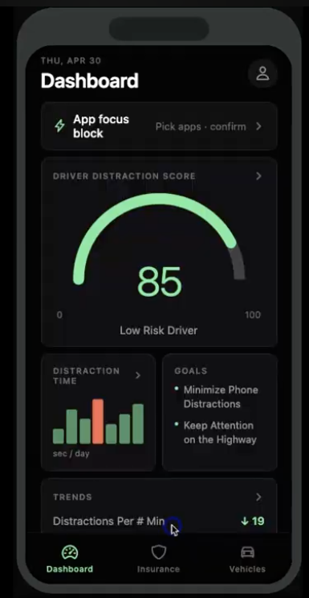

# Distraction Detector

Real-time distraction detection using your webcam. The program uses **MediaPipe Face Mesh** for head-pose estimation and **YOLOv8** for phone detection to determine whether you are distracted.

## How It Works

| Condition | Distracted? |
|-----------|-------------|
| Looking too far **left or right** (yaw > ±30°) | Yes |
| **Phone detected** AND you're **looking toward it** (head tilted down or turned toward the phone) | Yes |
| Phone detected but you're **looking straight ahead** | No |
| No phone, looking forward | No |

The key insight: simply holding a phone doesn't make you distracted — you must also be **looking at it**.

## Setup

```bash
# Create a virtual environment (recommended)
python3 -m venv venv
source venv/bin/activate   # macOS/Linux

# Install dependencies
pip install -r requirements.txt
```

> On first run, YOLOv8 will automatically download the `yolov8n.pt` weights (~6 MB).

## Run

```bash
python distraction_detector.py
```

Press **q** to quit.

## On-Screen Display

- **Green banner** = FOCUSED
- **Red banner** = DISTRACTED (with reason)
- **Yellow box** = Phone detected
- **Info panel** = Live yaw/pitch/roll angles, phone status, face status, FPS

## Tuning Thresholds

Edit the constants at the top of `distraction_detector.py`:

| Constant | Default | Meaning |
|----------|---------|---------|
| `YAW_DISTRACTED_THRESHOLD` | 30° | How far left/right before flagged |
| `PITCH_PHONE_THRESHOLD` | 15° | How far head tilts down toward phone |
| `YAW_PHONE_THRESHOLD` | 20° | How far head turns toward phone side |
| `PHONE_CONF_THRESHOLD` | 0.40 | YOLO confidence to count as a phone |
| `DISTRACTION_FRAME_BUFFER` | 5 | Consecutive frames before status changes (smoothing) |

## Dependencies

- Python 3.8+
- OpenCV
- MediaPipe
- Ultralytics (YOLOv8)
- NumPy

---

## 📱 Connected Project: CUBO Synced App

<p align="center">
  
</p>

An **AI-powered driving safety app** that connects to the CUBO dash device to monitor distracted driving, track driver behavior, and give parents or users clear reports to improve safety.

The app features:
- **Driver Distraction Score** — real-time safety rating
- **Distraction Time Tracking** — daily breakdowns of distraction events
- **Goals & Insights** — actionable goals like minimizing phone distractions and keeping attention on the highway
- **Trends Dashboard** — track distractions per minute over time
- **App Focus Block** — block distracting apps while driving

### 🎥 App Demo

[](https://www.youtube.com/watch?v=7hDUQYFQ1TE)

▶️ [Watch the full app demo on YouTube](https://www.youtube.com/watch?v=7hDUQYFQ1TE)

### 🔗 App Source Code

[](https://github.com/DhruvaValluru/CUBO-APP-SYNCE4DDEVICE)

---

<p align="center">
  <a href="mailto:dhruva.valluru@gmail.com"></a>
  &nbsp;
  <a href="https://www.linkedin.com/in/dhruvavalluru"></a>
  &nbsp;
  <a href="https://github.com/DhruvaValluru"></a>
</p>
